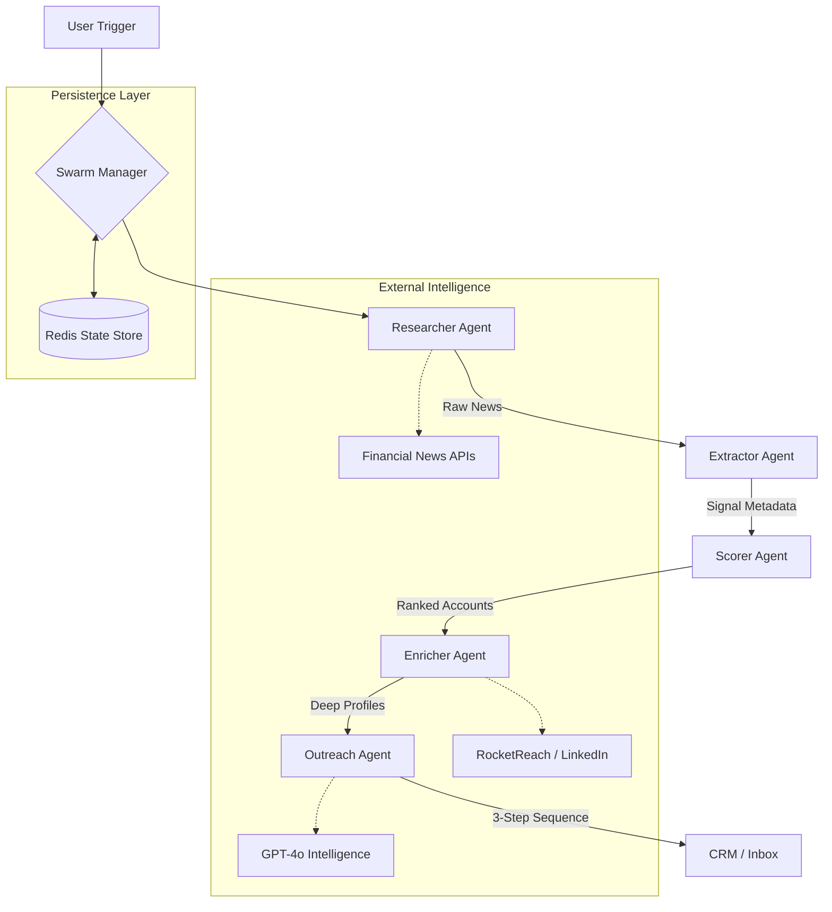

# 🚀 Blostem: Enterprise-Grade Fintech Signal Intelligence Swarm

Blostem is an autonomous multi-agent intelligence platform designed to transform raw market noise into hyper-personalized enterprise outreach. By leveraging a specialized swarm of AI agents, Blostem monitors the fintech landscape, identifies high-intent signals, scores prospects with precision, and drafts context-aware sequences for individual stakeholders.

---

## 🏗️ System Architecture

Blostem operates on a **Decoupled Swarm Architecture** where a centralized `SwarmManager` orchestrates a graph of specialized agents. Each agent is a standalone intelligence unit with its own set of tools and logic.

### 🔄 The Intelligence Flow



---

## 🤖 Meet the Swarm

### 1. 🔍 Researcher Agent
**Responsibility:** Discovery & Monitoring.
The Researcher scans global financial news, regulatory filings, and market updates. It filters for relevant fintech domains and ensures the pipeline is fed with fresh, high-quality information.

### 2. ⚡ Extractor Agent
**Responsibility:** Signal Processing.
It converts raw articles into structured data. It identifies specific "Why Now" events such as:
- **Funding Rounds** (Series A-E+)
- **Regulatory Actions** (SEC, FCA, RBI compliance events)
- **Product Launches** (New infrastructure or feature releases)
- **Partnerships** (Strategic integrations)

### 3. 🎯 Scorer Agent
**Responsibility:** Strategic Prioritization.
Using a multi-factor scoring model, this agent ranks companies based on:
- **Signal Intensity:** Urgency of the detected event.
- **Organization Type:** Neo-banks, Traditional Institutions, or PayFacs.
- **Compliance Urgency:** Regulatory pressure and timeline.

### 4. 💎 Enricher Agent
**Responsibility:** Deep Context & Contact Discovery.
It performs a "Deep Review" of the company's technical stack and market position. It then interfaces with **RocketReach** to find the exact stakeholders (CTOs, CEOs, VP Product) needed for outreach.

### 5. 📧 Outreach Agent
**Responsibility:** Sequence Personalization.
The final agent drafts a **3-step sequence** (Opener, Follow-up, Close) that references the specific signal discovered by the Researcher and the deep insights from the Enricher.

---

## 🛠️ Tech Stack

- **Backend:** Python (FastAPI), LangGraph, LangChain, Redis.
- **Frontend:** React, Tailwind CSS, TanStack Query, Lucide Icons.
- **AI/LLM:** OpenAI GPT-4o-mini, specialized system prompts.
- **Data:** RocketReach API for verified B2B contact intelligence.

---

## 🚀 Getting Started

### 1. Environment Setup
Create a `.env` file in the root directory:
```env
OPENAI_API_KEY=your_key
ROCKETREACH_API_KEY=your_key
REDIS_URL=redis://localhost:6379
```

### 2. Backend Installation
```bash
pip install -r requirements.txt
python server.py
```

### 3. Frontend Installation
```bash
cd frontend
npm install
npm run dev
```

---

## 📊 Dashboard Preview

Blostem features a **3-Pane Outreach Workbench**:
- **Pane 1**: Account ranking from Hot to Cold.
- **Pane 2**: AI-drafted email sequence editor.
- **Pane 3**: Deep Lead Profile (Verified Emails, LinkedIn, Title).

---

*Built for the future of agentic enterprise sales.*
